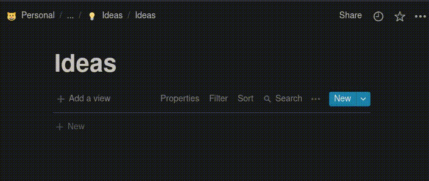

  

<h1 align="center">UNotion</h1>

----------

This is an extension for [ULauncher](https://ulauncher.io/).

### Save your ideas to Notion.

| |
|--------------------------------|

## Dependencies

This extensions needs `requests`, install it with pip3

* `pip3 install requests`

## Requirements

1. You need to create a database in Notion, and add a property called "Tags".
2. Then you need to create an integration [here](https://www.notion.so/my-integrations), and link it to your database
3. Put the token in the UNotion settings in Ulauncher

With this you should be able to see it in UNotion.

### Syntax

* Tile -> [Example] (Unique)
* Tags: #tag (Repeatable)
* More options in the future

----------

If you like my work you can

